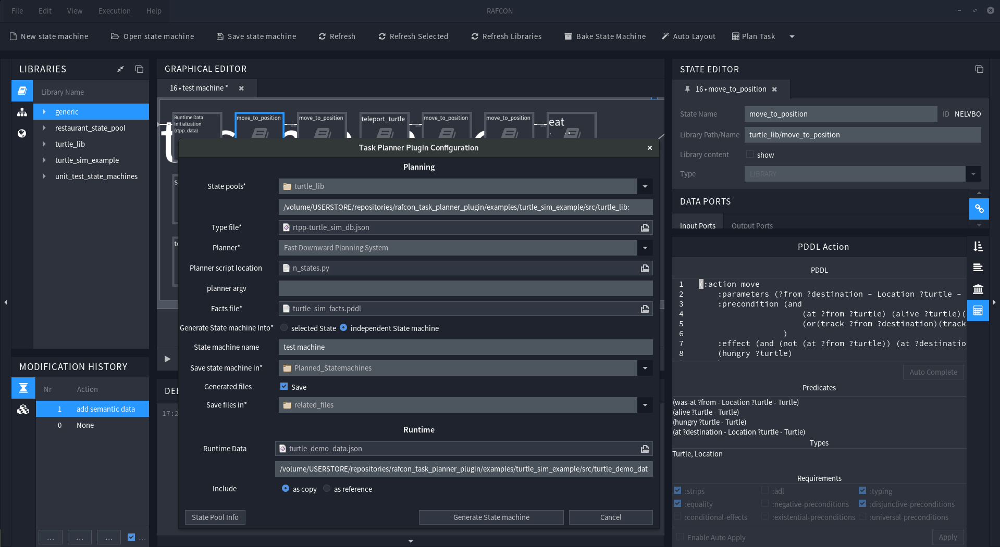

# Rafcon Task Planner Plugin

## Introduction
The Task Planner is a plugin for [RAFCON](https://dlr-rm.github.io/RAFCON/), which allows to automatically create, or extend state machines for given Tasks.  
To achieve this, states in RAFCON are annotated with semantic information, using the language [PDDL](https://en.wikipedia.org/wiki/Planning_Domain_Definition_Language). Then a semantic Planner such as [The Fast-Downward Planning System](http://www.fast-downward.org/) can usee this information, to find a solution for a given task. Afterwards the Plugin uses this solution to create a state machine out of it, or extend an existing one. 
## Features
+ Annotate States with PDDL Actions
+ Automatically generate a State machine for a given Task
+ Automatically extend a State machine
+ Configure the Plugin to inject runtime Data initialization into the state machine
+ Easily integrate a Semantic Planner

## Pddl Support

Since Pddl is extensive, we decided to provide a minimal Pddl set in the beginning, and extend our support on demand. So please feel free to contact us in order to increase our Pddl support. Currently the Plugin supports: 

- Only Actions in classical :parameter - [:precondition] - :effect pattern, without functions / fluents.
- due to the fact that the resulting state machines are executed in the real world, untyped variables are not supported.
