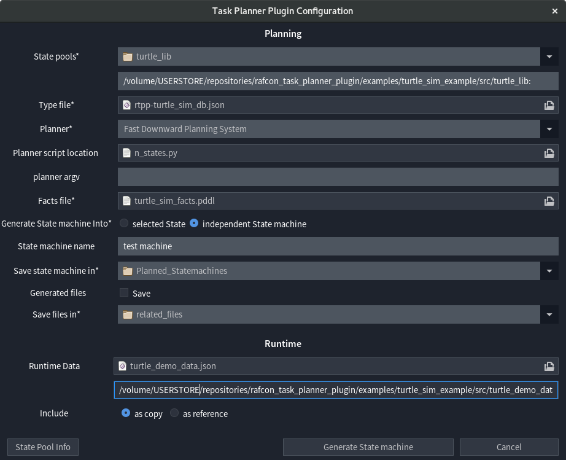

# The Planning Setup Form

The Planning setup form can be opened by clicking the "Plan Task" Button in the Menu bar of [RAFCON](https://dlr-rm.github.io/RAFCON/).  
It's the main Window of the Plugin, and the part where to configure a new Task, or get information about the current configuration.




- [Planning Section](#planning-section)
  * [State pools](#state-pools)
  * [Type File](#type-file)
  * [Planner](#planner)
  * [Planner Script Location](#planner-script-location)
  * [Planner Argv](#planner-argv)
  * [Facts File](#facts-file)
  * [Generate State Machine Into](#generate-state-machine-into)
  * [State Machine Name](#state-machine-name)
  * [Save State Machine In](#save-state-machine-in)
  * [Generated Files](#generated-files)
  * [Save Files In](#save-files-in)
- [Runtime Section](#runtime-section)
  * [Runtime Data](#runtime-data)
  * [Include](#include)
- [Buttons](#buttons)
  * [Generate State machine](#generate-state-machine)
  * [Cancel](#cancel)
  * [X In Upper Right corner](#x-in-upper-right-corner)
  * [State Pool Info](#state-pool-info)

<small><i><a href='http://ecotrust-canada.github.io/markdown-toc/'>Table of contents generated with markdown-toc</a></i></small>

## Planning Section

The Planning section contains all fields relevant for Planning and the State machine generation process. This section explains the fields in Detail.

### State pools

A state pool is a directory, containing PDDL-annotated States (but not all States in the directory have to be annotated).  
In the State pools field you can choose state pools you want allow the plugin to use in order to solve a particular Task.
During the generation process, all State pools are added as Rafcon Libraries, in which the directory name is used as Library name.    
The state pools field consists of two fields: A Directory chooser and a text field.  
All Directories choosen, are added to the text field as ':'- separated list. If you want to remove a State pool from the Task, just remove it from the list in text field. If you have a list already, you can easily paste it into the text field.

**Example**
```
/home/turtle_lib: tree
── turtle_lib
│   ├── clear_field
│   ├── __init__.py
│   ├── init_ros_node
│   ├── move_to_position
│   ├── teleport_turtle
│   └── turtle_position_subscriber

In this case for example 'move_to_position' is annotated with PDDL, and 'init_ros_node' is not 
(that's not recognizable in this view). The Statepool would be '/home/turtle_lib'.
Now adding '/home/turtle_lib' to the text field, would enable the Plugin to use 'move_to_position', 
as well as 'teleport_turtle' (which are annotated, that's not recognizable in this view) for planning. 
You will receive a warining for 'clear_field', 'init_ros_node' and 'turtle_position_subscriber'
(which are not annotated, that's also not recognizable in this view), but that dosen't matter as long as 
its intended.
The added Rafcon library would look like: 
                         Library: trutle_lib 
                         Path: /home/trutle_lib 
```

### Type File

Since PDDL uses Types and heredity, the plugin needs information about the Type hierarchy. This should be provided here.
The Type File Field is a File chooser. It expects a File of type json. It should contain the Type hierarchy as json dict, containing child types as keys and parent types as values. One child can only have one parent, and the defined hierarchy has to have exactly one root type. If you don't have a root type, you can add a hierarchy level, and derive your roots from 'Object'.
The root type (obviously) has no parent.  
**Important:** All your types used in the annotated States, or in your facts file have to be part of this hierarchy.

**Example**
```
file: my_types.json:
{
"Location":"Object",
"City":"Location",
"Country":"Location"
}
In this file, 'Location' is derived from 'Object', and the types 'City' and 'Country' are 
derived from Location. 'Object' is the root type.
```
### Planner

In this field it's settled which built-in planner should be used to Plan a particular Task, or a separate planner script should be used. If a built-in planner is not correctly installed, a notification is shown.  
The Planner field is a Drop-down entry Chooser, where you can select one Planner. If you choose `Other...`, you indicate that you will provide a planner script in the 'Planner script Location' field, and use your own planner.  
**Important:** If you forget to choose `Other...` your planner script will not be taken into consideration, but the choosen Planner will be used instead.

**Example**

Field Value | Description
---|-----
Fast Downward Planning System | The Fast Downward Planning System is used for Planning.
Fast Downward Planning System (!) Unavailable | The Fast Downward System is not (correctly) installed.
Other... | A Planner script provided in the 'Planner script Location' field will be usd.

### Planner Script Location

This field expects a python script, which will be responsible for the planning part of a Task. How to implement such a script can be found in The [Planner Integration Section](PlannerIntegration.md).  
The Planner Script Location field is a file chooser. The file choosen here will be used for Planning.  
**Important:** If `Other...` is not selected in the 'Planner' field, this field will be stored, but ignored during Task process.

**Example**

```
Field value: /my/scripts/my_planner_script.py

If Planner Scrip Location contains the value above, and 'Other...' is selected in the Planner field, 
the script 'my_planner_script.py' will be used for Planning in the Task.

```

### Planner Argv

If you want to configure the Planner e.g. The Fast Downward Planning system, you can insert an argument vector here. 
This field is an text entry, and it behaves like entering arugment into the console, e.g. Values enterd into this field are given to the planner script as space separated array. So all built in planners can be configured as specified in the original Planner documentation.

**Example**

```
When using the Fast Downward Planning System:
Possible planner Argv field value: --search "astar(lmcut())"
```

### Facts File

This Filechooser expects a Facts File written in Pddl. A Planning Task usually consits of a facts, and a domain file. Since the Plugin is using the State pools, as well as the type file to auto generate the domain file, you are only allowed to use elements provided in these two sources (state pools and type file), to write your Facts file. If you are not sure aboute which elements you configured, you can list them by clicking onto the 'State Pool Info' Button in the left corner of the Task Planner Plugin configuration window. 

**Example**

```
If Selecting /home/my_facts.pddl,
this file will be used as facts file during the Planning Process.
```

### Generate State Machine Into

The Plugin has two generation modi, one where a completely new State machine is created during a Task, and another where the Planning result is generated into an existing Hierarchy State.  
To select the mode, this field provides a radio button group. is 'independent State machine' was selected, the Plugin will create a new State machine, and if 'selected state' was choosen the Plugin will use an existing State to generate the planning result into.  
As the radio button name indicates, the plugin will try used the current selected State. Therefore it's mandatory, that exactly one state is selected, and that the selected State is a Hierarchy State.  
**Important**: To avoid accidents the plugin rejects non empty states. If you want to allow a particular state, to beused despite its not empty, you have to set the value of 'Allow_Override' in 'RAFCONTPP' in the Semantic Data Section of the State to 'True'. Then all child states of the Hierarchy State are automatically deleted before adding new ones.  
If 'selected State' is choose, the fields 'State machine name' and 'Save state machine in' are ignored.

**Example**

Value | Explanation
----|----
selected State | Generate into existing Hierarchy State.
independent State machine | Create new State machine.

### State Machine Name

The purpose of this text field is to enter the name, the resulting State machine will later have. If no name is provided, the name of the problem, defined in the facts file, is used instead. If 'selected State' in 'Generate State Machine Into' is choosen, this field is ignored.

**Example**

```
Example names are:
my_fancy_state_machine
planned_state_machine
task 42

```

### Save State Machine In

This field is a Directory chooser, and its purpose is, to set the path, where to save state machine, which is generated during the Task. If 'selected State' in 'Generate State Machine Into' is choosen, this field is ignored.  
**Important:** State machines with the same name, stored in the same path are overwritten.

**Example**

```
name: my_state_machine
Save State Machine In: /home/state_machines
With a configuration like this, the state machine my_state_machine will be stored in /home/state_machines
```

### Generated Files

During a Task some file are generated by the Plugin and the Planner. For example the Plugin will generate a Domain file, the Planner will (hopefully) generate a Plan, and maybe some other files. Usually they are not needed afterwards, but if you want to have a closer look, use them for debugging or need to keep them for logging purposes etc., you can tick the 'Save' Checkbox, and the files won't be deleted. If 'Save' is not ticked, all files are stored in the current working directory, and then deleted at the end of the Task.  

### Save Files In

This directory chooser specifies the path in which generated files should be stored. If 'Save' in Generated Files is not ticked, this field is ignored. 
**Important:** If the same path is used for multiple Tasks, some files maybe overwritten.

## Runtime Section

In This Context Runtime dosen't refere to the runtime of the Task, but rather to the runtime of the State machine, e.g. when its executed. This section was added to introduce Object resolution to the Plugin. since Pddl works identifiers e.g. robot1, munich or turtle_bob instead of complex Objects, a system to resolve these names during runtime was needed. How it works in detail can be seen in the [Data transfer section](DataTransfer.md). The Runtime Section part of the Configuration file specifies, if and how Object definitions should be added to the state machine.   


### Runtime Data

This field consists of a File chooser and a Text field. The file path, selected in the chooser, is set as value in the Text field. It does only accept one Path, and No list (like the state pool field). Also the chooser value is ignored, and only the text field value is used.  
The reason why both (chooser and field) are needed, is that a chooser is more convenient, but the path entered into the text field dosen't even necessarily to exist at this point in time, and so can't be choosen.  
The set file is expected to be a json file, in which all objects are defined.  
**Important:** If the textfield is left empty, the whole "Runtime" section is ignored.

**Example**

```
The file: /home/data/my_data.json
could look like this: 
{
 "robot1":{
          "payload":["rock1","rock2","rock3"],
          "position":"munich",
          "fuel":15
  },
"munich":{"x":48,"y":11}
}
```


### Include

This field consists of a radio button group, and defines if the data file (set in Runtime Data) should be copied or just a reference should be included.  

**as copy:** Choosing this radio button, the data will be copied during the State machine generation process. Therefore the file has to exist before generating the State machine, but not when running it. After the State machine was generated, file changes will have no effect on it.  
**as reference:** Choosing this radio button, a reference to the data file is included into the State machine, and the data is copied when starting the State machine. Therefore the file path does not have to exist during the generation Process, but during runtime.

**Example**

Button | description
---|---
as copy | Copies the file during generation process.
as reference | Copies the file everytime the State machine is started.


## Buttons

This Section explains each button of the Planning Setup Form.

### Generate State machine

This Button saves the current configuration, and starts the State machine Generation Process.

### Cancel

This Button saves the current configuration, and Closes the Planning Setup Form.

### X In Upper Right corner

This Button closes the Planning Setup Form without saving it.

### State Pool Info

This Button provides Information about the current Configuration. To be fully functional the configuration of 'State pools', and the 'Type file' is required. 

It shows: 
- All configured State pools
- A list of all configured Pddl Actions
- A list of all available Types
- a list of all available Predicates


