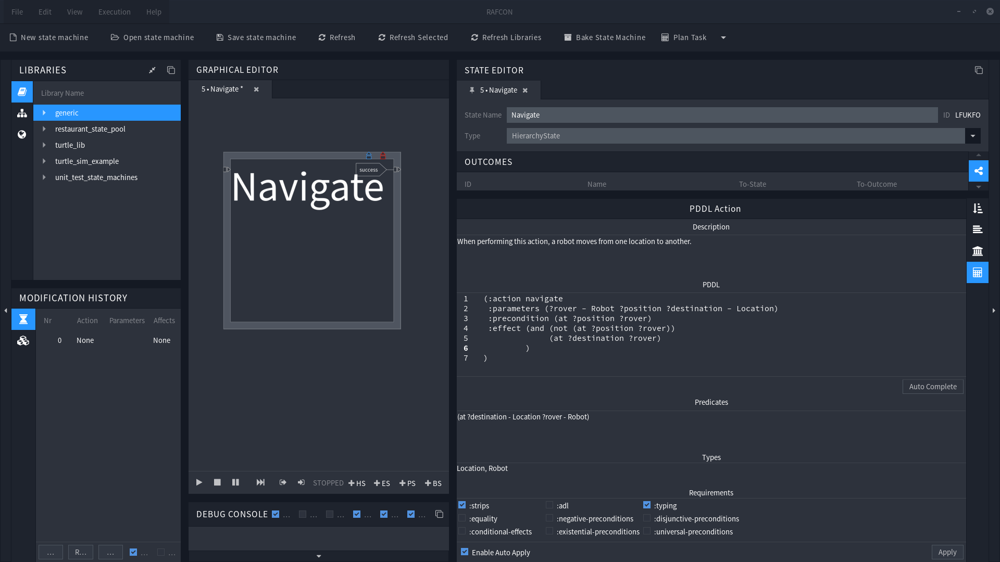

# RAFCON Task Planner Plugin

## Overview
The RAFCON Task Planner Plugin is a [RAFCON](https://github.com/DLR-RM/RAFCON) plugin to interface arbitrary pddl planner such as the [Fast Downward Planning System](http://www.fast-downward.org/).  
It's purpose is to use such planners to plan a predefined scenario, and generate a RAFCON state machine out of the found plan. 
To achieve this, the plugin extends RAFCON, so that a state's semantic can be expressed via a pddl action. Subsequently, a set of such pddl annotated states can be used to auto-generate a domain file, find a plan for a handwritten problem and generate a state machine based on the solution.  
One important aspect is that the Task Planner Plugin is able to interface abritrary planner. So new planners can be quickly integrated using a python script. This mechanism was for example used to successfully integrate the [Fast Downward](http://www.fast-downward.org/), as well as the [Fast-Forward](https://fai.cs.uni-saarland.de/hoffmann/ff.html) Planning System.

## Installation
Currently the plugin is available on GitHub and PyPi. Information about how to obtain and install it from one of these platforms, is available at the homepage's [Getting Started Section](https://dlr-rm.github.io/rafcon-task-planner-plugin/pages/documentation/GettingStarted.html). 

## Plugin Homepage
Documentation as well as some tutorials are available at the [Plugin's Homepage](https://dlr-rm.github.io/rafcon-task-planner-plugin/).

