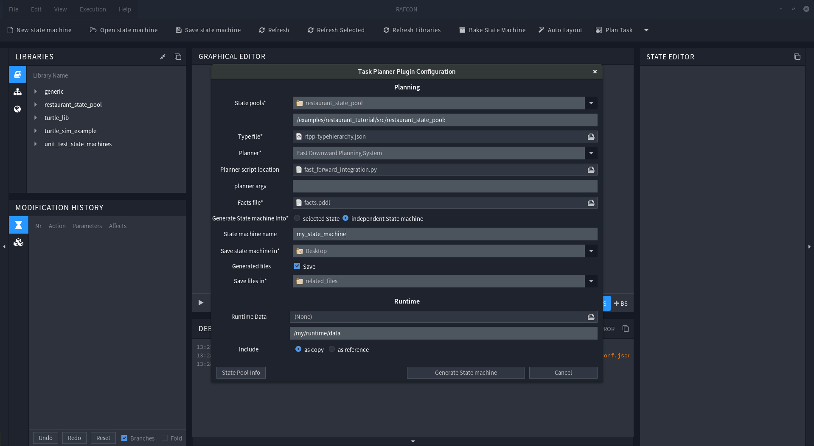

# Rafcon Task Planner Plugin

## Overview

The Rafcon Task Planner Plugin is a [RAFCON](https://github.com/DLR-RM/RAFCON) plugin to interface arbitrary Pddl planner such as the [Fast-Downward planning System](http://www.fast-downward.org/).  
Its purpose is to use such planners to plan a predefined scenario, and generate a Rafcon State machine out of the found plan. 
To achieve this, the plugin extends Rafcon, so that a States semantic can be expressed via a Pddl Action. Then later on, a set of such Pddl annotated Stated can be used to auto generate a Domain file, plan a handwritten problem and generate a State machine out of the solution.  
One important aspect is, that the Task Planner should be able to interface abritrary Planner. Therefore new Planners can be quickly integrated using a python script.

## Installation
To install the Plugin two steps are required: 
1. `git clone <repository>`
2. Add the Plugin Path to Rafcons PLUGIN_PATH Variable. (see [RAFCON Doc](https://rafcon.readthedocs.io/en/latest/plugins.html)) `RAFCON_PLUGIN_PATH=$RAFCON_PLUGIN_PATH:[repository_path]/source/rafcontpp` 

## Usage
An Introduction how to use the Plugin can be found in the first [Tutorial](/examples/restaurant_tutorial).
An Intorduction how the dataflow works can be found in the second [Tutorial](/examples/turtle_sim_example).

The Plugin Documentation can be found [here](https://wiki.robotic.dlr.de/RAFCON/Task_Planner_Plugin)

## Support
### Planner Support
Currently the Task Planner Plugin supports two Planners as "built-in", namely The [Fast-Downward planning System](http://www.fast-downward.org/) and The [Fast-Forward Planning System V2.1](https://fai.cs.uni-saarland.de/hoffmann/ff.html). Even they are called "built-in", it doesn't mean that they come with the Plugin. You have to install them separately according to the guide in the [Wiki]().  

If you want to use any other Planner, you have to [integrate it yourself](). But thats usually no Problem and should be done in 10 to 15 minutes. If you have an awesome Planner, and think it should be a must-have in the Plugin, please contact us!

### Python Support

At the moment This Plugin only supports Python2.7 for sure, but we are planning to also support Python3 soon.

### Pddl Support

Since Pddl is extensive, we decided to provide a minimal Pddl set in the beginning, and extend our support on demand. So please feel free to contact us in order to increase our Pddl support. Currently the Plugin supports: 

- Only Actions in classical :parameter - [:precondition] - :effect pattern, without functions / fluents.
- due to the fact that the resulting state machines are executed in the real world, untyped variables are not supported.
