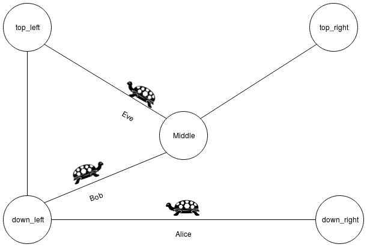

# 2. Turtle Sim Example

This example should demonstrate how the **data flow** can work in a planned state machine and how **flexible** they are even when using them with **Ros**.
The example is base on rafcons [turtle demo](https://rafcon.readthedocs.io/en/latest/tutorials.html#starting-the-basic-turtle-demo-state-machine-using-ros), but the states were modified to use the plugins data flow style, and enriched with PDDL actions.

- [2.1 Scenario description](#21-scenario-description)
- [2.2 Requirements](#22-requirements)
- [2.3 Setup](#23-setup)
  * [2.3.1 trutle_sim_state_machine](#231-trutle%5Fsim%5Fstate%5Fmachine)
  * [2.3.2 turtle_sim_core_machine](#232-turtle%5Fsim%5Fcore%5Fmachine)
  * [2.3.3 turtle_lib](#233-turtle%5Flib)
- [2.4 Planning](#24-planning)
  * [2.4.1 Planning](#241-planning)
    + [2.4.1.1 State pools](#2411-state-pools)
    + [2.4.1.2 Type file](#2412-type-file)
    + [2.4.1.3 Planner](#2413-planner)
    + [2.4.1.4 Facts file](#2414-facts-file)
    + [2.4.1.5 State machine name](#2415-state-machine-name)
    + [2.4.1.6 Save state machine in](#2416-save-state-machine-in)
  * [2.4.2 Runtime](#242-runtime)
    + [2.4.2.1 Runtime Data](#2421-runtime-data)
    + [2.4.2.2 Include](#2422-include)
- [2.5 Execution](#25-execution)
- [2.6 Last Words on Data Flow](#26-last-words-on-data-flow)

<small><i><a href='http://ecotrust-canada.github.io/markdown-toc/'>Table of contents generated with markdown-toc</a></i></small>

## 2.1 Scenario description
The scenario consists of:
- a map with five points (down_left, down_right, top_left, top_right and middle) 
- and three turtles (alice, bob and eve).

With the following rules:
- turtles can only move between connected points
- if a turtle moves it gets hungry
- if turtles are hungry they can eat eachother

In this example, Alice, Bob and Eve will wander arround in the map, but Bob is a cannibal, therefore he will eat Alice and Eve at some point.

## 2.2 Requirements 
 - RAFCONː `pip install --user rafcon` orː `git clone git@rmc-github.robotic.dlr.de:common/rafcon.git` (for information about how to install rafcon see: https://github.com/DLR-RM/RAFCON)
 - The Rafcon Task Planner Pluginː `git clone git@rmc-github.robotic.dlr.de:moro/rafcon_task_planner_plugin.git`
 - The Fast Downward Planning Systemː `pip install --user downward-dlr --no-compile` (evt. you have to install the wheel package first) 
 - A running ROS core (as described in rafcons [turtle demo](https://rafcon.readthedocs.io/en/latest/tutorials.html#starting-the-basic-turtle-demo-state-machine-using-ros))
 - A running turtlesim node (also as described in rafcons [turtle demo](https://rafcon.readthedocs.io/en/latest/tutorials.html#starting-the-basic-turtle-demo-state-machine-using-ros))

## 2.3 Setup
1. Start the ROS core: `roscore`
2. Start the turtlesim node: `rosrun turtlesim turtlesim_node`
3. Start RAFCON with the Plugin in your ros environment: `export RAFCON_PLUGIN_PATH=/path/to/tpp/plugin`
4. Add the following two paths as RAFCON Library Paths:   
   Library: `turtle_lib` Path: `[Repository_PATH]/rafcon_task_planner_plugin/examples/turtle_sim_example/src/turtle_lib`  
   Library: `turtle_sim_example` Path: `[Repository_PATH]/rafcon_task_planner_plugin/examples/turtle_sim_example/src`  

If we have a look into the **turtle_sim_example** Library, we can see **turtle_lib** as well as the two state machines **turtle_sim_core_machine** and **turtle_sim_state_machine**.

### 2.3.1 trutle_sim_state_machine  
turtle_sim_state_machine is the one we will execute later. If you open it now, you will see that it just initializes a ros node, and then executing the turtle_sim_core_machine. If you want you can execute it now, but since we didn't plan the core machine yet, nothing spectacular will happen.

### 2.3.2 turtle_sim_core_machine   
This is the machine we will plan, and also the one where everything happens. Inside of the Core Turtles are spawned, moved and eaten.

### 2.3.3 turtle_lib  
This folder contains a bunch of states. These are the bricks used to plan our scenario. Most of them are enriched with a PDDL action, but not all. So don't be surprised, if the plugin warns you later on during the planning process. 

## 2.4 Planning

Now we are ready to plan the core state machine. Because this is an example, and not a tutorial everything was prepared for you, and you only have to configure the Task Planner Plugin by hiting **Plan Task**

### 2.4.1 Planning
The data we enter in this section is important during the Planning and generation process.
#### 2.4.1.1 State pools
We use our turtle_lib as state pool, it should be:  `[Repository_PATH]/rafcon_task_planner_plugin/examples/turtle_sim_example/src/turtle_lib`

#### 2.4.1.2 Type file
The type files location is `[Repository_PATH]/rafcon_task_planner_plugin/examples/turtle_sim_example/src/rtpp-turtle_sim_db.json`  
Since we have only Turtles and Locations, it is really small, and uninteresting.

#### 2.4.1.3 Planner
Use as Planner the **Fast Downward Planning System**.

#### 2.4.1.4 Facts file 
The facts files location is `[repository_PATH]/rafcon_task_planner_plugin/examples/turtle_sim_example/src/turtle_sim_facts.pddl`.
Feel free to play around with it later!

#### 2.4.1.5 State machine name
Since we want to (re)plan the `turtle_sim_core_machine`, we should give our state machine the same name i.e. `turtle_sim_core_machine`.

#### 2.4.1.6 Save state machine in
We want to replan the turtle_sim_core_machine e.g. overwriting it, therefor we should save our State machine in `[repository_PATH]/rafcon_task_planner_plugin/examples/turtle_sim_example/src`

### 2.4.2 Runtime
This section is not important during the planning process, but during runtime of the state machine we plan.
#### 2.4.2.1 Runtime Data
If we enter a path to a json file here, the plugin will add a data initialization state as first state of the planned state machine.
As we know a planner would return something like **move bob middle** and not **move bob x=5, y=5**. However, ROS needs coordinates, and don't know where **middle** is. To solve this issue, we use **middle** as an object identifier, and define the object in a file. Its path is `[repository_PATH]/rafcon_task_planner_plugin/examples/turtle_sim_example/src/turtle_demo_data.json`.
Feel free to have a look into the file, and see all object definitions.

#### 2.4.2.2 Include
At this radio button group we can decide, if we want to add the data directly into the state, or if we only want to reference the data file. This can be usefull in lots of situations, but in our scenario its unimportant. So you can try both if you want. 

Now we can generate the core state machine.

## 2.5 Execution
Finally, we have planned the core machine, and are ready to watch turtles moving around. Just open the **turtle_sim_state_machine**, and refresh it bevore execution. 

Have fun!

## 2.6 Last Words on Data Flow

As we have seen above we get somehow an object identifier in our states, and somewhere is a definition for this identifier stored in a json file. But how does this actually work? - It's like this:

All definitions you made in the file are available during runtime in a dictionary called **rtpp_data**, which is stored as a global variable in RAFCON. For example let's assume you got the object identifier `top_left` (which is a location of our example), and want to know the locations x-coordinate: 

1. At first you would like to get the rtpp_data dictionary:   
   `rtpp_data = gvm.get_variable('rtpp_data')`

2. As second step you would like to have the actual `top_left` object:  
  `top_left_object = rtpp_data['top_left']`

3. And in the last step you would get the x-coordinate like this:  
   `x = top_left_object['x_coordinate']`
   
You can also combine it in a single statement: `x = gvm.get_variable('rtpp_data')['top_left']['x_coordinate']`

