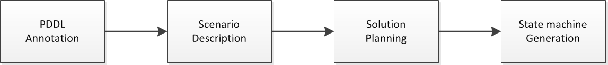

# Overview

 
 

The general idea of this plugin is to automatically generate functional state machines for a given scenario, in order to execute them on a Robot.  
The first step to achieve that, is to **annotate modular states** in [RAFCON](https://dlr-rm.github.io/RAFCON/) e.g. skills, with a semantic description, namely a [PDDL](https://en.wikipedia.org/wiki/Planning_Domain_Definition_Language) action. A collection of such skills is then refered to as state pool. The second step is to **describe the scenario** and the desired goals, as a facts file in PDDL. In the third step, the plugin is using the description and the state pool, to generate a domain file, feed both (the domain and the facts file) into a semantic planner, which **plannes a solution**. In a last step, the plan, which is the result of the previous process, is used to **generate a state machine**, which is executable in RAFCON.
 
Since the annotation step needs to be done once per skill only, this plugin not only allows to build state machines quickly (compared to manual createn), but also ad hoc for different scenarios.  