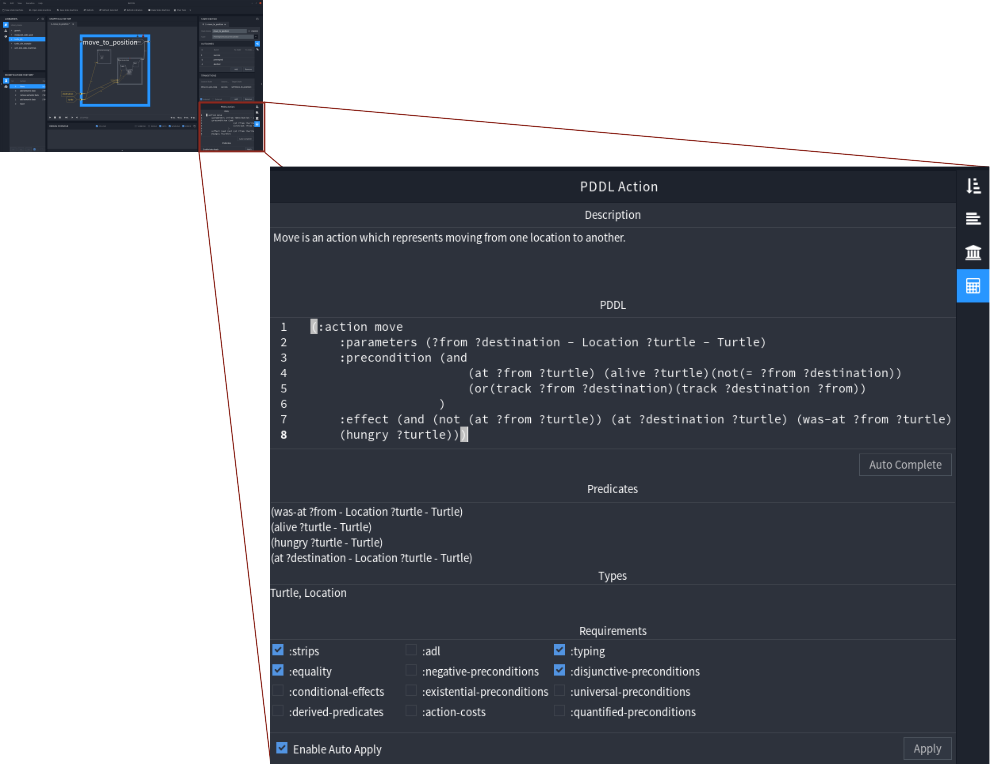

# PDDL Action Tab

The plugin introduces a new tab in the state editor. It's called the PDDL Action Tab, and its symbol is a small calculator.  
The tabs gives the possibility to annotate a state with a [PDDL](https://en.wikipedia.org/wiki/Planning_Domain_Definition_Language) action, and so to make it usable for the plugin.




- [Tab Fields](#tab-fields)
  * [Description](#description)
  * [PDDL](#pddl)
  * [Predicates](#predicates)
  * [Types](#types)
  * [Requirements](#requirements)
- [Buttons](#buttons)
  * [Auto Complete](#auto-complete)
  * [Apply](#apply)
  * [Enable Auto Apply](#enable-auto-apply)

<small><i><a href='http://ecotrust-canada.github.io/markdown-toc/'>Table of contents generated with markdown-toc</a></i></small>


## Tab Fields

The tab consists of several fields, describing the state's semantic in PDDL. This section explains these fields in detail. 

### Description

The Description field is a text field. It has documentation purposes, and should contain a description and hints for the PDDL action. It is not used by the plugin.

### PDDL

The action in PDDL syntax should be pasted or written (not recomended) into this code editor field. Information about, what aspects of PDDL are supported by the Plugin can be found in the section [PDDL Support](Limitations.md#pddl-support). When generating a domain while processing a task, this field is copy pasted one by one. It's also parsed during the "Auto Complete" process. So only valid PDDL code, as well as PDDL comments are allowed here.

**Example**

```PDDL
;That is my move action
(:action move
:parameters (?form ?to - Location ?subject - Vehicle)
:precondition (at ?from ?subject)
:effect (and (not (at ?from ?subject)) (at ?to ?subject))
)
```

### Predicates

The Predicates text field should be filled with all different predicates, the action in the 'PDDL' field uses. Due to the fact, that all predicates in the Action are applied, the parameter types have to be added. This field is the foundation of the predicates section in the auto generated domain file. For the plugins point of view, no type hierarchy is defined yet. Therefore the list should not only contain all predicates with different names, but also predicates with the same name, and different types (It's also not a good idea to merge predicates by hand, because the type hierarchy may change in the future.).

**Example**

According to the example above [(the PDDL action)](#pddl) the predicates field would 
contain one predicate: <br>
`(at ?from - Location ?subject - Vehicle)`<br>

Another, imaginary example is: <br>
```
(at ?a - Location ?b - Vehicle)
(at ?a - Location ?c - Cargo)
(in ?c - Cargo ?b - Vehicle)
```

### Types

The Types text field should contain all types, which are used in the action in the 'PDDL' field. The types must be separated by spaces or commas. This field is used to decide which types, the types section in the auto generated domain file will contain. 

**Example**  
According to the example above [(the PDDL action)](#pddl) the Types field would look like this:

```
Location, Vehicle
```

### Requirements

This checkboxes represent requirements on PDDL planners. For example, if an action uses types (all actions in the plugin do that), the planner requirement would be ':typing'. All requirements, the action in the 'PDDL' field has, should be ticked here.

## Buttons

The PDDL Action tab comes with a few Buttons. These are described in this section.

### Auto Complete

The Auto Complete Button is located between the 'PDDL' and the 'Predicates' field. As it's title indicates, it tries to auto complete the predicates, types and requirements fields, and applies all changes. First to mention: It tries. Currently no bugs are known, and usually it finds all predicates, types and requirements needed, but there is NO warranty. Secondly: It's auto complete. Therefore it will just add input to the fields, but not override them.  

### Apply

The Apply Button is located in the footer of the action tab. The plugin stores all information of the PDDL action in the "Semantic Data" Tab of vanilla RAFCON. so the apply Buttons purpose is, transmit the entered data from the PDDL Action Tab into the semantic data tab.<br>   
**Important:** Hitting the Apply Button will not store the PDDL data persistent. It is just persistent after saving the state machine. If the state was saved but the Apply button wasn't clicked, the PDDL action tab is also not saved.

### Enable Auto Apply

If Auto Apply is enabled, all changes are automatically applied. Usually enabeling is recomended, but due to some performance issues,it should be disabled when writing a (long) description or coding in the PDDL field.  
