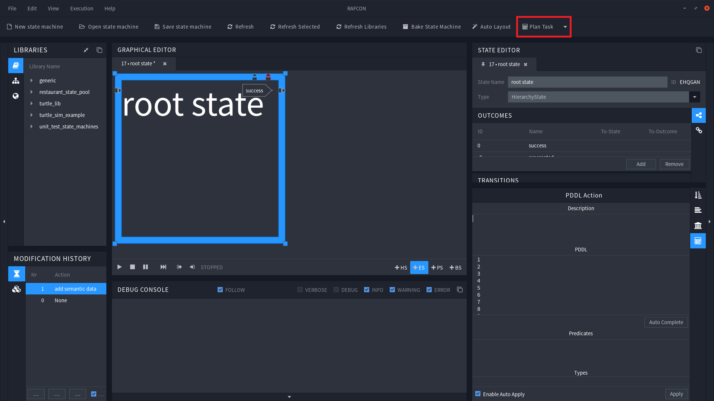

# Plan Task Button

The Plan Task Button is located in [RAFCONS](https://dlr-rm.github.io/RAFCON/) Menu Bar. It is a combination of a button and a drop-down menu. When clicked, the button opens the [Setup Form](/PlanningSetupForm.md), which allows to configure the plugin, and plan a task. The button also shows the number of currently running tasks, indicated by a number in brackets, e.g. "Plan Task (2)".  
The drop-down menu on the other hand, lists all running tasks by their name, and their runtime in seconds. When hovering over a task, the name of the planner used in the specific task is shown. Clicking on a task gives the ability to abort it.
