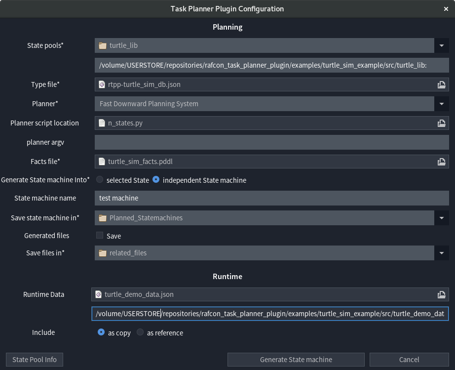

# The Planning Setup Form

The Planning Setup Form can be opened by clicking the "Plan Task" Button in the menu bar of [RAFCON](https://dlr-rm.github.io/RAFCON/).  
It's the main window of the plugin. So it is the part where to start a new state machine generation process, configure a new task, and get information about the current configuration.




- [Planning Section](#planning-section)
  * [State pools](#state-pools)
  * [Type File](#type-file)
  * [Planner](#planner)
  * [Planner Script Location](#planner-script-location)
  * [Planner Argv](#planner-argv)
  * [Facts File](#facts-file)
  * [Generate State Machine Into](#generate-state-machine-into)
  * [State Machine Name](#state-machine-name)
  * [Save State Machine In](#save-state-machine-in)
  * [Generated Files](#generated-files)
  * [Save Files In](#save-files-in)
- [Runtime Section](#runtime-section)
  * [Runtime Data](#runtime-data)
  * [Include](#include)
- [Buttons](#buttons)
  * [Generate State machine](#generate-state-machine)
  * [Cancel](#cancel)
  * [X In Upper Right corner](#x-in-upper-right-corner)
  * [State Pool Info](#state-pool-info)

<small><i><a href='http://ecotrust-canada.github.io/markdown-toc/'>Table of contents generated with markdown-toc</a></i></small>

## Planning Section

The planning section contains all fields relevant for planning, and the state machine generation process. This section explains the fields in detail.

### State Pools

A state pool is a directory, containing PDDL-annotated states (but not all states in the directory have to be annotated).  
In the State pools field all stated pools should be choosen, which can be to use to solve a particular Task.
During the generation process, all state pools are added as RAFCON libraries, in which the directory name is used as Library name.<br>
The state pools field consists of two fields: A directory chooser and a text field.  
All directories choosen, are added to the text field as ':'- separated list. To remove a state pool from the task, it just has to be removed from the list in text field. Also paths can be added to the list manually.

**Example**
```
/home/turtle_lib: tree
── turtle_lib
│   ├── clear_field
│   ├── __init__.py
│   ├── init_ros_node
│   ├── move_to_position
│   ├── teleport_turtle
│   └── turtle_position_subscriber
```
In this case for example, 'move_to_position' is annotated with PDDL and 'init_ros_node' is not 
(that's not recognizable in this view). The state pool would be '/home/turtle_lib'.
Now adding '/home/turtle_lib' to the text field, would enable the plugin to use 'move_to_position', 
as well as 'teleport_turtle' (which are annotated, that's not recognizable in this view) for planning. 
There will be a warining for 'clear_field', 'init_ros_node' and 'turtle_position_subscriber'
which are not annotated (that's also not recognizable in this view), but that dosen't matter as long as 
it is intended.<br>
The added RAFCON library would look like: <br>
```
Library: trutle_lib <br>
Path: /home/trutle_lib 
```

### Type File

Since PDDL uses types and heredity, the plugin needs information about the type hierarchy. This should be provided here.
The type file field is a file chooser. It expects a file of type json. It should contain a type hierarchy as json dict, structured to contain child types as keys and parent types as values. One child can only have one parent, and the defined hierarchy has to have exactly one root type. In case a hierarchy has multiple root types, one additional level can be added, deriving all root types from 'Object' for example. The root type (obviously) has no parent.<br>
**Important:** All types used in a state pool, or in the facts file have to be part of this hierarchy.<br>

**Example**<br>
In this file, 'Location' is derived from 'Object', and the types 'City' and 'Country' are 
derived from Location. 'Object' is the root type.
```
file: my_types.json:
{
"Location":"Object",
"City":"Location",
"Country":"Location"
}
```
### Planner

In this field it's defined which built-in planner should be used to plan a particular task, or a separate planner script should be used. If a built-in planner is not correctly installed, a notification is shown.  
The planner field is a drop-down entry chooser. If "Other..." was choosen, it is indicated that a planner script is provided in the 'Planner script Location' field, which will be used for planning. <br>
**Important:** If "Other..." was not choosen the planner script will not be taken into consideration, and the choosen Planner will be used instead.
<br><br>
**Example**

Field Value | Description
---|-----
Fast Downward Planning System | The Fast Downward Planning System is used for planning.
Fast Downward Planning System (!) Unavailable | The Fast Downward System is not (correctly) installed.
Other... | A planner script provided in the 'Planner script Location' field will be used.

### Planner Script Location

This field expects a python script, which will be responsible for the planning part of a task. How to implement such a script is explained in the [Planner Integration Section](PlannerIntegration.md).  
The planner script location field is a file chooser. The file choosen here will be used for planning.<br>
**Important:** If "Other..." is not selected in the 'Planner' field, this field will be stored, but ignored during task process.
<br><br>
**Example**

If Planner Scrip Location contains the value above, and 'Other...' is selected in the Planner field, 
the script 'my_planner_script.py' will be used for Planning in the Task.
```
Field value: /my/scripts/my_planner_script.py
```

### Planner Argv

To configure the planner e.g. The Fast Downward Planning system, an argument vector can be inserted here. 
This field is an text entry, and it behaves like entering arugment into the console, e.g. Values enterd into this field are given to the planner script as space separated array. So all built-in planners can be configured as specified in the original planner documentation.<br>

**Example**<br>
When using the Fast Downward Planning System, a possible planner argv field value:
```
 --search "astar(lmcut())"
```

### Facts File

This file chooser expects a facts file written in Pddl. A planning task usually consits of a facts, and a domain file. Since the plugin is using the state pools, as well as the type file to auto generate the domain file, it is only allowed to use elements provided in these two sources (state pools and type file), to write a facts file. To ensure which elements are usable, they can be listed by clicking on to the 'State Pool Info' Button in the left corner of the Task Planner Plugin configuration window. 
<br><br>
**Example**<br>

```
If Selecting /home/my_facts.pddl,
this file will be used as facts file during the planning process.
```

### Generate State Machine Into

The plugin has two generation modi, one where a completely new state machine is created during a task, and another where the planning result is generated into an existing Hierarchy State.  
To select the mode, this field provides a radio button group. If 'independent State machine' was selected, RTPP will create a new state machine. If 'selected state' was choosen the plugin will use an existing state to generate the planning result into.  
As the radio button name indicates, the plugin will try used the current selected state. Therefore it's mandatory, that exactly one state is selected, and that the selected state is a Hierarchy State. If the selected Hierarchy State is a root state, RTPP will copy it, and use it to generate a new, independent state machine for performance reasons.<br>
**Important**: To avoid accidents RTPP rejects non empty states by default. To allow a particular state, to be used despite it's not empty, the value of 'Allow_Override' in 'RAFCONTPP' in the semantic data section of the state hast to bet set to 'True'. Then all child states of the Hierarchy State are automatically deleted before adding new ones. If 'selected State' is choosen, the fields 'State machine name' and 'Save state machine in' are ignored.<br>

**Example**<br>

Value | Explanation
----|----
selected State | Generate into existing Hierarchy State.
independent State machine | Create new State machine.
<br>
### State Machine Name

The purpose of this text field is to enter the name, the resulting State machine will later have. If no name is provided, the name of the problem, defined in the facts file, is used instead. If 'selected State' in 'Generate State Machine Into' is choosen, this field is ignored.<br>

**Example**<br>

```
Example names are:
my_fancy_state_machine
planned_state_machine
task 42

```

### Save State Machine In

This field is a directory chooser, and its purpose is to set the path, where to save state machine, which is generated during the Task. If 'selected State' in 'Generate State Machine Into' is choosen, this field is ignored.<br>
**Important:** State machines with the same name, stored in the same path are overwritten.<br><br>
**Example**<br>
With a configuration like this, the state machine my_state_machine will be stored in /home/state_machines:
```
name: my_state_machine
Save State Machine In: /home/state_machines
```

### Generated Files

During a task some file are generated by the plugin and the planner. For example the plugin will generate a domain file, the planner will (hopefully) generate a plan, and maybe some other files. Usually they are not needed afterwards, but it is useful to keep them for debugging or logging purposes etc. When the'Save' checkbox was ticked, the files won't be deleted. If 'Save' is not ticked, all files are stored in a temporary path, and then deleted at the end of the Task.  

### Save Files In

This directory chooser specifies the path in which generated files should be stored. If 'Save' in generated files is not ticked, this field is ignored.<br>
**Important:** If the same path is used for multiple Tasks, some files maybe overwritten.

## Runtime Section

In this context runtime dosen't refere to the runtime of the task generation process, but rather to the runtime of the State machine itself, e.g. when its executed. This section was added to introduce object resolution to the plugin. since PDDL works with identifiers e.g. robot1, munich or turtle_bob instead of complex objects, a system to resolve these names during runtime is needed. How this works in detail is explained on [Data transfer page](DataTransfer.md). The runtime section part of the configuration file specifies, if and how object definitions should be added to the state machine.   


### Runtime Data

This field consists of a file chooser and a text field. The file path, selected in the chooser, is set as value in the text field. It does only accept one path, and no list (like the state pool field). Also the chooser value is ignored, and only the text field value is used.  
The reason why both (chooser and field) are needed, is that a chooser is more convenient, but the path entered into the text field dosen't even necessarily have to exist at this point in time and so can't be choosen.  
The choosen file is expected to be a json file, in which all objects are defined.<br>
**Important:** If the textfield is left empty, the whole "Runtime" section is ignored.
<br><br>
**Example**

```
The file: /home/data/my_data.json
could look like this: 
{
 "robot1":{
          "payload":["rock1","rock2","rock3"],
          "position":"munich",
          "fuel":15
  },
"munich":{"x":48,"y":11}
}
```


### Include

This field consists of a radio button group, and defines if the data file (set in Runtime Data) should be copied or just a reference should be included.  

**as copy:** Choosing this radio button, the data will be copied during the state machine generation process. Therefore the file has to exist before generating the State machine, but not when executing it. After the state machine was generated, file changes will have no effect on it.<br>
**as reference:** Choosing this radio button, a reference to the data file is included into the state machine, and the data is copied when starting the state machine execution. Therefore the file path does not have to exist during the generation process, but during runtime.

**Example**

Button | description
---|---
as copy | Copies the file during generation process.
as reference | Copies the file everytime the State machine is started.

<br>
## Buttons

This section explains each button of the planning setup form.

### Generate State machine

This button saves the current configuration, and starts the state machine generation process.

### Cancel

This button saves the current configuration, and closes the planning setup form.

### X In Upper Right corner

This Button closes the planning setup form without saving it.

### State Pool Info

This button provides information about the current configuration. To be fully functional the configuration of 'State pools', and the 'Type file' are required. 

It shows: 
- All configured State pools
- A list of all configured Pddl Actions
- A list of all available Types
- A list of all available Predicates


