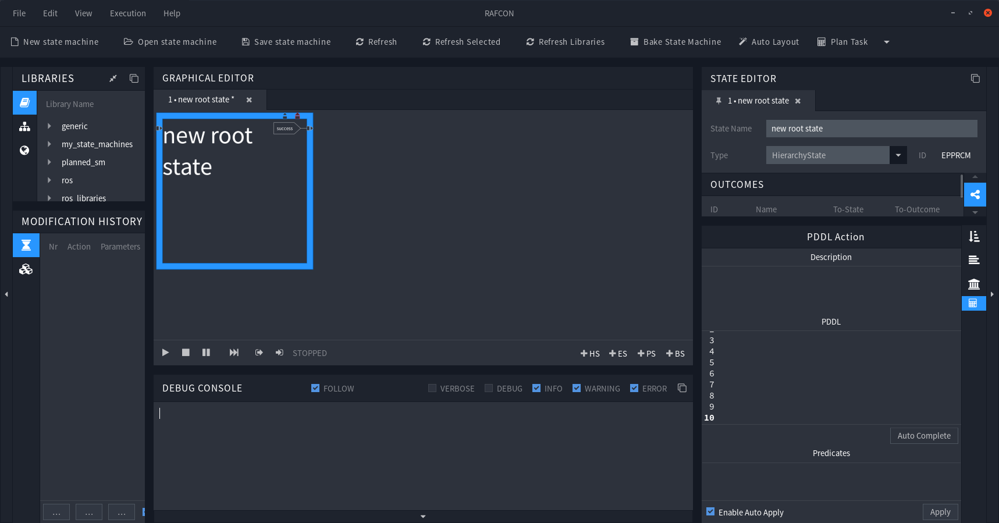
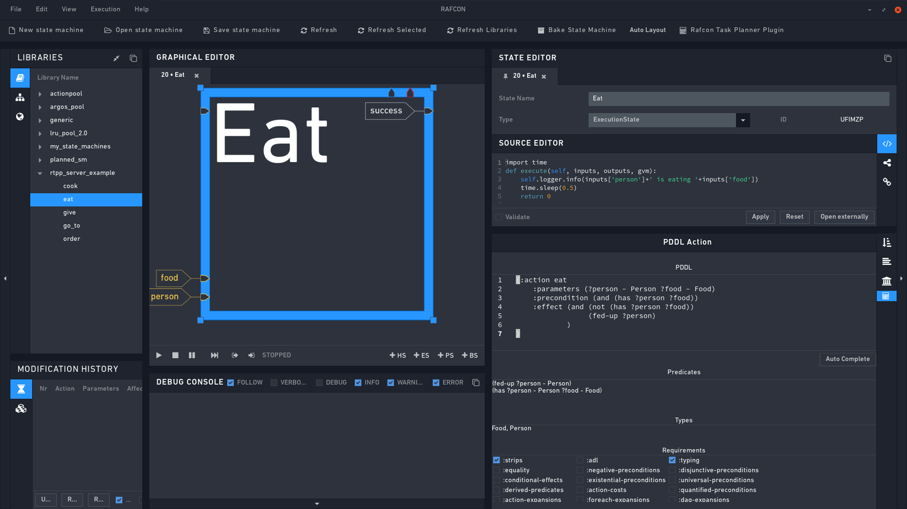
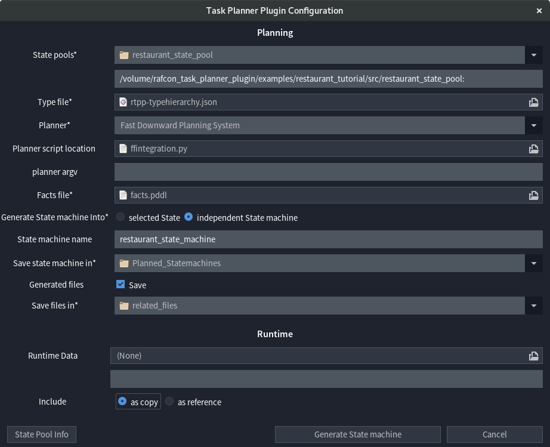
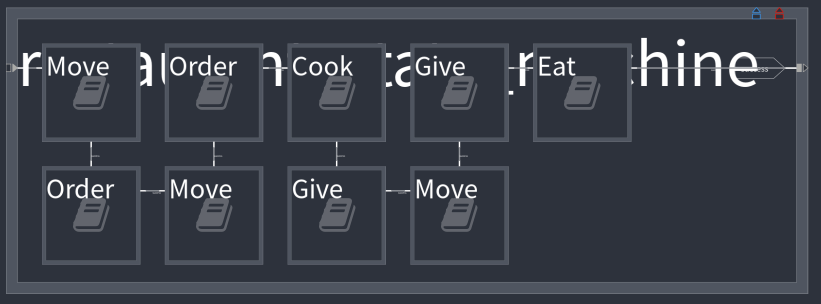

# 1. Restaurant Tutorial

This tutorial introduces the **basic functionality** of the RAFCON Task Planner Plugin (RTPP), by leading through a little example.

- [1.1 Scenario description](#11-scenario-description)
- [1.2 Requirements / Pre-Setup](#12-requirements--pre-setup)
- [1.3 First Step](#13-first-step)
- [1.4 Preparing some States](#14-preparing-some-states)
  * [1.4.1 Eat](#141-eat)
  * [1.4.2 Cook](#142-cook)
  * [1.4.3 Give](#143-give)
  * [1.4.4 Move](#144-move)
  * [1.4.5 Order](#145-order)
- [1.5 Type Hierarchy](#15-type-hierarchy)
- [1.6 Facts Facts Facts](#16-facts-facts-facts)
- [1.7 Planning a State machine](#17-planning-a-state-machine)
- [1.8 Solution](#18-solution)

<small><i><a href='http://ecotrust-canada.github.io/markdown-toc/'>Table of contents generated with markdown-toc</a></i></small>


## 1.1 Scenario Description

Our scenario takes place in a little pizzeria. There is the chef Bob, who is baking pizza, the waiter James serving the guests,
and one guest: Alice.   

Let's assume, Alice is really hungry, and wants to eat some pizza. In this tutorial, we want to create a state machine, to feed Alice, e.g. A state machine, that models the process of Alice ordering a pizza in the restaurant, Bob baking, and James serving it, so that Alice is able to eat it.
 
## 1.2 Requirements / Pre-Setup

To be able to run this tutorial, you need: 

 - **RAFCON**: <br>
 `pip install rafcon` <br>
 or: `git clone https://github.com/DLR-RM/RAFCON.git` (for information about how to install RAFCON see: [install RAFCON](https://github.com/DLR-RM/RAFCON))<br>
 - **The RAFCON Task Planner Plugin**:<br>
  `git clone https://github.com/DLR-RM/rafcon-task-planner-plugin.git`<br>
 - **The Fast Downward Planning System**:<br>
  `pip install downward-dlr --no-compile` (possibly, you have to install the wheel package first)<br>
 
## 1.3 First Step 
At first, RTPP has to be registered in RAFCON. To do so, the plugin path has to be added to the "RAFCON_PLUGIN_PATH" environmental variable:<br>
`RAFCON_PLUGIN_PATH=$RAFCON_PLUGIN_PATH:[RTPP-REPOSITORY̠-PATH]/source/rafcontpp`


If you did this successfully and restarted RAFCON, it should now have an extra menu button called "Plan Task", and a new tab called "PDDL Action" at the right, below the semantic data tab. The image shows RAFCON with the task planner plugin loaded.



## 1.4 Preparing some States
All in all five states are involved in the process. You have to create and store them in a directory of your choice, from now on referenced as [your_folder]. 

### 1.4.1 Eat
To give Alice the ability to eat her pizza, we have to create the state eat by executing the following steps:

1. Create a new state machine in RAFCON

2. Change it's state name to "Eat" and its type to "ExecutionState".

3. Add the two input ports "food" and "person", both of type str (all input ports have to be of type str).

4. Insert the following code into the state's source editor:  
      ```python
      import time   
      def execute(self, inputs, outputs, gvm):
          self.logger.info(inputs['person']+' is eating '+inputs['food'])
          time.sleep(0.5)
          return 0
    
      ```
5. Now we have to open the PDDL Action Tab below the Semantic Data Section. (NOT the RAFCONTPP dictionary in the Semantic Data Section)

6. If you want, you can write a description text into the **Description field**, it's for your documentation.

7. Every state has a corresponding **PDDL Action**, which represents it's semantic meaning. Insert the following action into the PDDL section of the tab: 
    ```Pddl
    (:action eat
       :parameters (?person - Person ?food - Food)
       :precondition (and (has ?person ?food))
       :effect (and (not (has ?person ?food))
                    (be-full ?person)
               )
    )
    ```     
    The action is called eat, and has also two parameters: ?person of type Person and ?food of type Food<br>
    **IMPORTANT**: The names of the variables ?person and ?food have to match with the names of the state's input ports person and food (neglecting the questionmarks). But in general not every parameter of the action has to have an corresponding input port in the state and vice versa. 

8. In further states you can click auto complete, (beware: auto complete is just a best effort approach, it works fine in most cases (I don't know a case yet, where it doesn't work), nevertheless you should check the results.) but in this first state i will explain all fields.

9. In the **Predicates section** you have to insert the predicates, which are used by the action. In this case, the predicates are "be-full" and "has". They are used for example as "(has ?person ?food)". The complete predicate (we have to insert the complete predicate into the field) would be "(has ?person - Person ?food - Food)".  
   In this section variable names don't matter, just the predicate name and its types. So (has ?person - Person ?food - Food) and (has ?dosent - Person ?matter - Food) are the same predicate, but (has ?person - Object ?food - Food) would be a different one because it differs in the type "Object".  
   According to this, we have to insert the following into the predicate section:
    ```Pddl
    (be-full ?person - Person)
    (has ?person - Person ?food - Food) 
    ```   

10. In the **Types field**, we have to list all types which are needed by the action. In our case, we can insert the types "Food" and "Person" as comma separated string.
    ```Pddl
    Food, Person
    ``` 
11. The **Requirements Section** is a bit complicated, and not all of them are decidable at this point in time. If you want to know, when to check which box, please follow the [pddl 2.1 standard](https://arxiv.org/pdf/1106.4561.pdf). In this case we have to check the ":strips" and the ":typing" box. ":strips" because we use conjunction and negative effects, and ":typing" because we use types e.g. Food and Person.
    ```
    check the fields: :typing and :strips
    ```
12. Save the state into [your_folder]. 

Once you are finish, your state should look like in the figure below.




Repeat this process with the following states: 

### 1.4.2 Cook

Giving Bob the ability to cook in the kitchen: 

**StateName:** `Cook`  
**Type:** `ExecutionState`  
**Input Ports:** `chef, food (type str)`  
**Source Editor:** 
```python
import time
def execute(self, inputs, outputs, gvm):
   self.logger.info(inputs['chef']+' is cooking '+inputs['food'])
   time.sleep(1.5)
   return 0
```
**PDDL Action:**
```Pddl
(:action cook
   :parameters (?chef - Chef ?food - Food)
   :precondition (wants ?chef ?food)
   :effect (and (has ?chef ?food)(not(wants ?chef ?food)))
)
```

**Other fields:** Hit Auto Complete

### 1.4.3 Give

Give someone the ability to handover food:  


**StateName:** `Give`  
**Type:** `ExecutionState`  
**Input Ports:** `interlocutor1, interlocutor2, food (type str)`  
**Source Editor:** 
```python
import time
def execute(self, inputs, outputs, gvm):
   self.logger.info(inputs['interlocutor1']+' gives '+inputs['food']+' to '+inputs['interlocutor2'])
   time.sleep(0.5)
   return 0
```
**PDDL Action:**
```Pddl
(:action give
   :parameters (?interlocutor1 ?interlocutor2 - Person ?food - Food ?loc - Location)
   :precondition (and (at ?loc ?interlocutor1)
                      (at ?loc ?interlocutor2)
                      (wants ?interlocutor2 ?food)
                      (has ?interlocutor1 ?food)
                 )
   :effect (and 
           (not (wants ?interlocutor2 ?food))
           (not (has ?interlocutor1 ?food))
           (has ?interlocutor2 ?food)
           )
)
```
**Other fields:** Hit Auto Complete

### 1.4.4 Move
Give the James the ability to move around: 

**StateName:** `Move`  
**Type:** `ExecutionState`  
**Input Ports:** `destination, name (type str)`  
**Source Editor:** 
```python
import time
def execute(self, inputs, outputs, gvm):
   self.logger.info(inputs['name']+' is moving to '+inputs['destination'])
   time.sleep(0.5)
   return 0

```

**PDDL Action:**
```Pddl
(:action got-to
   :parameters (?start ?destination - Location ?name - Waiter)
   :precondition (and (at ?start ?name))
   :effect (and (not (at ?start ?name))(at ?destination ?name))
)
```

**Other fields:** Hit Auto Complete

### 1.4.5 Order

Give Alice the ability to order her pizza: 

**StateName:** `Order`  
**Type:** `ExecutionState`  
**Input Ports:** `food, interlocutor1, interlocutor2 (type str)`  
**Source Editor:** 
```python
import time
def execute(self, inputs, outputs, gvm):
   self.logger.info(inputs['interlocutor2']+' is ordering '+inputs['food']+' from '+inputs['interlocutor1'])
   time.sleep(0.5)
   return 0
```

**PDDL Action:**
```Pddl
(:action order
   :parameters (?interlocutor1 ?interlocutor2 - Person ?food - Food ?loc - Location)
   :precondition (and (at ?loc ?interlocutor1)
                      (at ?loc ?interlocutor2)
                      (wants ?interlocutor2 ?food)
                 )
   :effect (and 
               (wants ?interlocutor1 ?food)
           )
)
```

**Other fields:** Hit Auto Complete


Once your are finish, you should have a folder, containing the five states. 

## 1.5 Type Hierarchy
 As you may have noticed, we are using types in the PDDL actions. But you don't know the hierarchy of these types yet, and the plugin does that neither. Therefore we need a separate file, where this hierarchy is specified. Let's call it **rtpp-typehierarchy.json** it contains the following: 
 
 ```json
{
"Person":"Object",
"Food":"Object",
"Location":"Object",
"Chef":"Person",
"Waiter":"Person",
"Guest":"Person"
}
```

The structure of the file is a dictionary with types as keys, and their parents as values. For example, the type "Waiter" is extending the type "Person", and "Person" is extending "Object", which is the root type and has no parent. 

## 1.6 Facts Facts Facts

As final step, we have to describe our problem, or better our goal, our initial state (init), and all "objects", which are present in our world. In this case the **objects** are James the waiter, Bob the chef, Alice the guest, a pizza, the kitchen, the table and the entrance of the restaurant. At the beginning of our situation (**init**) Bob is where chefs are: in the kitchen. James is standing at the entrance, waiting for new guests and Alice is sitting at a table. She is really hungry and wants a pizza. The **goal** is to bring Alice her pizza and make her feel full. Written in pddl, this could look like this: 
```Pddl
(define (problem alice_is_hungry)(:domain restaurant)
(:objects 
   james - Waiter
   bob - Chef
   alice - Guest
   pizza - Food
   kitchen table entrance - Location
)
(:init
   (at entrance james)
   (at table alice)
   (at kitchen bob)
   (wants alice pizza)
)
(:goal (and
   (be-full alice)
   )
))
```

Copy it, and save it in a file, **facts.pddl** 

## 1.7 Planning a State Machine

Now we are ready. We have: 
1. A folder containing five prepared states
2. A rtpp-typehierarchy.json file, containing the type hierarchy
3. A facts.pddl file, containing our problem

Let's hit the "Plan Task" Button:

**State pools:** This should contain the folder, where you saved the prepared states in.  
**Type file:** Enter the location of your rtpp-typehierarchy.json file here.  
**Planner:** Choose the Fast Downward Planning System (you installed it at the beginning of this tutorial).  
**Planner script location:** Leave it at it is (it's not considered as long as you don't choose "Other..." in the Planner field.). If you want to use your own planner with the plugin, you can enter the location of your integration script here.  
**planner argv:** Leave it empty. If you want to pass arguments directly to the planner, you can enter them here.  
**Facts file:** Enter the location of your facts.pddl file.  
**Generate State machine Into:** Select independent state machine. If you select "selected state", the state machine would be generated into the current selected state.
**State machine name:** Let's call it restaurant_state_machine.  
**Save state machine in:** Enter the location, where the plugin should save the state machine it will generate.  
**Generated files:** The plugin will create additional files, like a domain, or the plan to solve the problem. If you want to keep them, check this button.  
**Save files in:** Specifies the location, where to save generated files.  
**Runtime Data:** Leave it empty.  
**Include:** As long as Runtime Data is empty, this buttons are not considered, so we don't need to change something here.   



If we hit the "Generate State machine" button now, the planner will try to solve the scenario. Afterwards the found plan will be used to create a state machine.


If we execute the state machine now, the console output should look like below, as you can see Alice is getting her pizzaǃ 
```consoleOutput
INFO - Go to: james is moving to table
INFO - Order: alice is ordering pizza from james
INFO - Go to: james is moving to kitchen
INFO - Order: james is ordering pizza from bob
INFO - Cook: bob is cooking pizza
INFO - Give: bob gives pizza to james
INFO - Go to: james is moving to table
INFO - Give: james gives pizza to alice
INFO - Eat: alice is eating pizza 
```


You can't just plan this one state machine, but arbitrary manyǃ For example, let's assume Alice brought her friend Eve, who wants a soup, and Bob wants to eat a sandwich at work. The facts file would look like below, but feel free to play around, test other scenarios, and try to plan them. 
```Pddl
(define (problem serve_guest) (:domain restaurant)
(:objects 
   james - Waiter
   bob - Chef
   alice eve - Guest
   pizza soup sandwich - Food
   kitchen table entrance - Location
)
(:init
   (at entrance james)
   (at table alice)
   (at table eve)
   (at kitchen bob)
   (wants alice pizza)
   (wants eve soup)
   (wants bob sandwich)
)
(:goal (and
   (be-full alice)
   (be-full eve)
   (be-full bob)
   )))
```
## 1.8 Solution

A solution for this tutorial is provided in:<br> 
`[repository_path]/examples/restaurant_tutorial`<br>
There you find all described files, and states as well as an executable restaurant_state_machine and all related files, generated during the planning process. To load the restaurant_state_machine, which is located inside of the restaurant_state_pool, you must add the library path to RAFCON:
 ```
 Library Path:[repository_path]/examples/restaurant_tutorial/restaurant_state_pool
 Library Key: restaurant_state_pool
 ```

