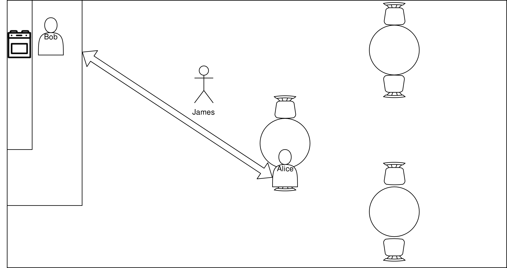

# 3. Robex - Seismic Network Example

This example is based on a moon analogue mission, conducted at Mt. Etna by the ROBEX Alliance in the years 2016 and 2017. During the ["Autonomous Passive Seismic Experiment"](http://www.robex-allianz.de/en/about-robex/demo-missions/), a rover called the "LRM" had to take four seismometers (RU) from a Lander, and place them 
as sensor network on the ground. To ensure that each unit functioned correctly, the rover had to drive to the deploy location, level the ground, optimizie the contact between sensor and surface, and test it by giving a ground impulse. 
To achieve autonomy, RAFCON was used and a state machine was manually prepared in advance.  
 
This example shows, how to go on step further by also generating the state machine, needed to accomplish the task, automatically. To simulate the environment, and the LRM, Gazebo and ROS where used. 
<!--https://www.hjkc.de/_blog/2017/07/05/8319-raumfahrt-mission-robex-unter-mondbedingungen-auf-dem-vulkan-aetna-durchgefuehrt/-->
## 3.1 Scenario Description
## 3.2 LRM Skills

<table>
<tr valign="top"><th>Skill</th><th>Description</th></tr>
<tr><td>Analyse Ground</td><td>Detects, wether the surface is suitable for placing a RU.</td></tr>
<tr><td>Carry RU</td><td>Carries a RU to it's defined deploy location.</td></tr>
<tr><td>Complete Deployment</td><td>A PDDL related helper "skill" for convenience.</td></tr>
<tr><td>Grasp From Lander</td><td>Grasps a RU from the lander.</td></tr>
<tr><td>Ground Impulse</td><td>Gives an ground impulse with it's manipulator.</td></tr>
<tr><td>Level Ground</td><td>Uses an attached RU to level the ground.</td></tr>
<tr><td>Locate World Objects</td><td>Updates the world model of the rover.</td></tr>
<tr><td>Navigate to RU on Lander</td><td>Navigates to a position nearby the lander, where it can grasp a particual RU from.</td></tr>
<tr><td>Optimize Contact</td><td>Optimizes the contact between a RU and the ground.</td></tr>
<tr><td>Place RU</td><td>Attaches it's manipulator to a RU, it carries, and takes it from it's back.</td></tr>
<tr><td>Release RU</td><td>Release a RU, it's manipulator is attached to.</td></tr>
<tr><td>Retract From RU</td><td>Separates itself from a RU, to gain full navigation capabilities again.</td></tr>
</table>

## 3.3 Showcase Video
