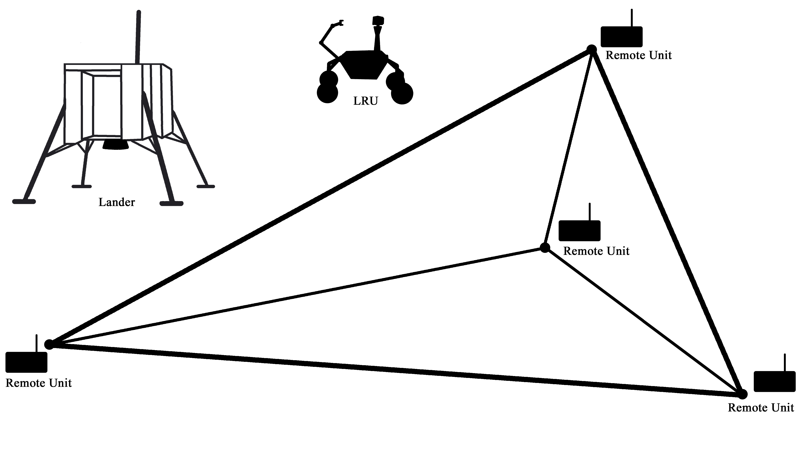
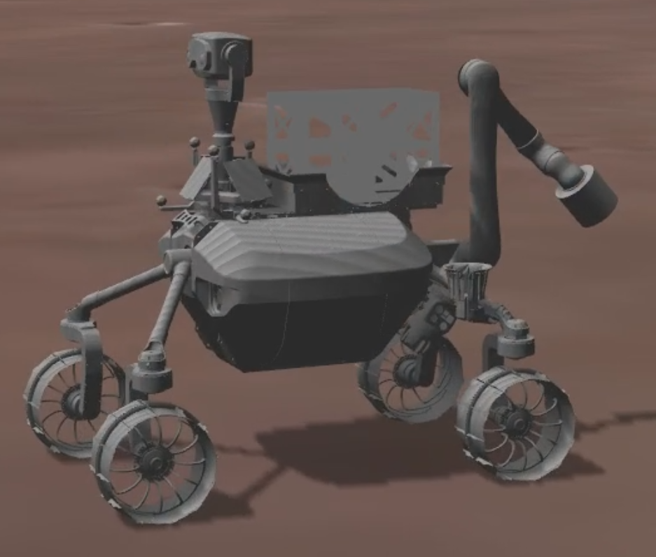

# 3. Robex - Seismic Network Example

This example is a **showcase**, and demonstrates how the plugin can be used to automatically generate a state machine, that is executable on a **ROS-Gazebo stack**.<br>
It is based on a Moon analogue mission, conducted at Mt. Etna by the [ROBEX Alliance](http://www.robex-allianz.de/) in the years 2016 and 2017. During the [Autonomous Passive Seismic Experiment](http://www.robex-allianz.de/en/about-robex/demo-missions/), a rover, called the [Lightweight Rover Unit (LRU)](https://www.dlr.de/rm/desktopdefault.aspx/tabid-11431/20129_read-47344/) had to take four seismometers (RU) from a Lander, and place them as sensor network on the ground.<br>
The network's purpose was to measure seismic activities, and detect their origin. As discovered during the Apollo missions, such events do not only occur here on earth's Mt. Etna for example, but also on it's trabant: The Moon. <br>
The LRU is a mobile robot, built for autonous planetary exploration, and disaster recovery. Therefore, it is equiped with a manipulator, as well as a stereo camera, and other cutting-edge technologies. <br>
In order to take advantage of this high degree of autonom capabilities, the flow control tool [RAFCON](https://dlr-rm.github.io/RAFCON/) was used, and a state machine, representing the task, was manually prepared in advance.
<br>
This example shows, how to go on step further by also generating the state machine, needed to accomplish the task, automatically. To simulate the environment and the LRU, [Gazebo](http://gazebosim.org/) and [ROS](https://www.ros.org/) where used. 
<!--https://www.hjkc.de/_blog/2017/07/05/8319-raumfahrt-mission-robex-unter-mondbedingungen-auf-dem-vulkan-aetna-durchgefuehrt/-->

- [3.1 Scenario Description](#31-scenario-description)
- [3.2 LRU Skills](#32-lru-skills)
- [3.3 PDDL Task Plan](#33-pddl-task-plan)
- [3.4 Showcase Video](#34-showcase-video)

<small><i><a href='http://ecotrust-canada.github.io/markdown-toc/'>Table of contents generated with markdown-toc</a></i></small>



## 3.1 Scenario Description


Initially all four Remote Units (RUs), which is a more abstract name for the seismometers, are attached to the lander, and the LRU is located next to it.<br>
LRU's task is, to arrange the RUs, to form a sensor network. Therefore, it has to grasp each RU individually from the lander, carry it to it's position in the network, and deploy it.<br>
The LRU deploys a RU, by first grasping the seismometer from it's back, and use it afterwards to level the ground, before placing the RU, and optimizing it's ground contact. The last step of deployment is to test the sensors functionyllity. So the LRU uses it's manipulator, to give a ground impulse.


## 3.2 LRU Skills
The LRU has some capabilities, which can be used by the plugin to find a plan, and generate the state machine, necessary to fullfill the task. These Skills are listed below:  


<table>
<tr valign="top"><th>Skill</th><th>Description</th></tr>
<tr><td>Analyse Ground</td><td>Detects, wether the surface is suitable for placing a remote unit.</td></tr>
<tr><td>Carry RU</td><td>Carries a RU to it's defined deploy location.</td></tr>
<tr><td>Complete Deployment</td><td>A PDDL related helper "skill" for convenience.</td></tr>
<tr><td>Grasp From Lander</td><td>Grasps a remote unit from the lander.</td></tr>
<tr><td>Ground Impulse</td><td>Gives an ground impulse with it's manipulator.</td></tr>
<tr><td>Level Ground</td><td>Uses an attached remote unit to level the ground.</td></tr>
<tr><td>Locate World Objects</td><td>Updates the world model of the rover.</td></tr>
<tr><td>Navigate to RU on Lander</td><td>Navigates to a position nearby the lander, where it can grasp a particual RU from.</td></tr>
<tr><td>Optimize Contact</td><td>Optimizes the contact between a remote unit and the ground.</td></tr>
<tr><td>Place RU</td><td>Attaches it's manipulator to a RU, it carries, and takes it from it's back.</td></tr>
<tr><td>Release RU</td><td>Release a RU, it's manipulator is attached to.</td></tr>
<tr><td>Retract From RU</td><td>Separates itself from a remote unit, to gain full navigation capabilities again.</td></tr>
</table>

## 3.3 PDDL Task Plan

The resulting state machine was generated based on this plan. It was created by the [Fast Downward Planning System](http://www.fast-downward.org) during the task planning process (comments where added later on, to increase readability):


```Pddl
;Deploy Remote Unit 1
(move_to_ru_on_lander ru1 lru lander)
(locate_world_objects lru)
(grasp_ru_from_lander ru1 lru lander)
(carry_ru_to_deploy_location ru1 lru)
(locate_world_objects lru)
(place_ru ru1 lru)
(level_ground ru1 lru)
(optimize_ru_contact ru1 lru)
(release_ru ru1 lru)
(give_ground_impulse_for_ru ru1 lru)
(complete_ru_deployment ru1 lru)
(retract_from_remote_unit lru)

;Deploy Remote Unit 2
(move_to_ru_on_lander ru2 lru lander)
(locate_world_objects lru)
(grasp_ru_from_lander ru2 lru lander)
(carry_ru_to_deploy_location ru2 lru)
(locate_world_objects lru)
(place_ru ru2 lru)
(level_ground ru2 lru)
(optimize_ru_contact ru2 lru)
(release_ru ru2 lru)
(give_ground_impulse_for_ru ru2 lru)
(complete_ru_deployment ru2 lru)
(retract_from_remote_unit lru)

;Deploy Remote Unit 3
(move_to_ru_on_lander ru3 lru lander)
(locate_world_objects lru)
(grasp_ru_from_lander ru3 lru lander)
(carry_ru_to_deploy_location ru3 lru)
(locate_world_objects lru)
(place_ru ru3 lru)
(level_ground ru3 lru)
(optimize_ru_contact ru3 lru)
(release_ru ru3 lru)
(give_ground_impulse_for_ru ru3 lru)
(complete_ru_deployment ru3 lru)
(retract_from_remote_unit lru)

;Deploy Remote Unit 4
(move_to_ru_on_lander ru4 lru lander)
(locate_world_objects lru)
(grasp_ru_from_lander ru4 lru lander)
(carry_ru_to_deploy_location ru4 lru)
(locate_world_objects lru)
(place_ru ru4 lru)
(level_ground ru4 lru)
(optimize_ru_contact ru4 lru)
(release_ru ru4 lru)
(give_ground_impulse_for_ru ru4 lru)
(complete_ru_deployment ru4 lru)
(retract_from_remote_unit lru)
```


## 3.4 Showcase Video
