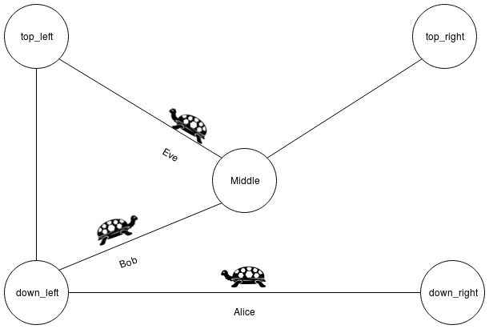
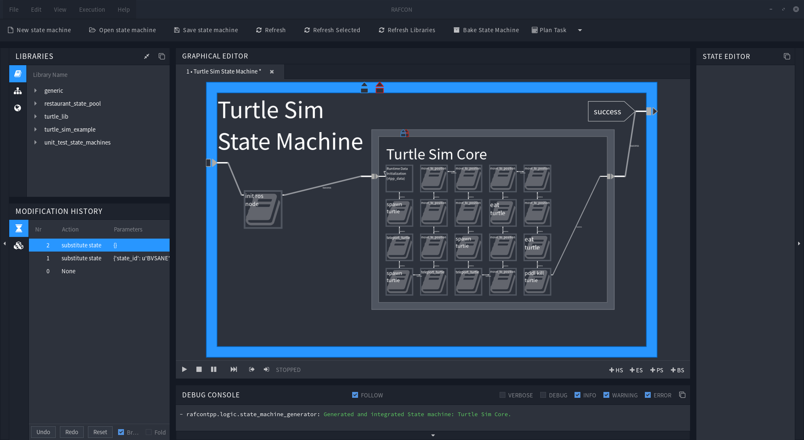
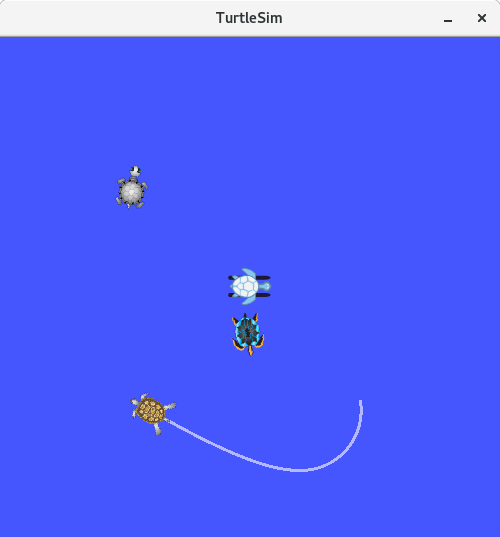

# 2. Turtle Sim Example

This example demonstrates how the **data flow** can work in a planned state machine and how **flexible** they are even when using them with **ROS**.
The example is base on RAFCON's [turtle demo](https://rafcon.readthedocs.io/en/latest/tutorials.html#starting-the-basic-turtle-demo-state-machine-using-ros), but the states were modified to use the plugin's data flow style and are enriched with PDDL actions.

- [2.1 Scenario description](#21-scenario-description)
- [2.2 Requirements](#22-requirements)
- [2.3 Setup](#23-setup)
  * [2.3.1 trutle_sim_state_machine](#231-trutle%5Fsim%5Fstate%5Fmachine)
  * [2.3.2 Turtle Sim Core](#232-turtle%5Fsim%5Fcore)
  * [2.3.3 turtle_lib](#233-turtle%5Flib)
- [2.4 Planning](#24-planning)
  * [2.4.1 Planning](#241-planning)
    + [2.4.1.1 State pools](#2411-state-pools)
    + [2.4.1.2 Type file](#2412-type-file)
    + [2.4.1.3 Planner](#2413-planner)
    + [2.4.1.4 Facts file](#2414-facts-file)
    + [2.4.1.5 Generate State machine Into](#2415-generate-state-machine-into)
    + [2.4.1.6 State machine name](#2416-state-machine-name)
    + [2.4.1.7 Save state machine in](#2417-save-state-machine-in)
  * [2.4.2 Runtime](#242-runtime)
    + [2.4.2.1 Runtime Data](#2421-runtime-data)
    + [2.4.2.2 Include](#2422-include)
- [2.5 Execution](#25-execution)
- [2.6 Last Words on Data Flow](#26-last-words-on-data-flow)

<small><i><a href='http://ecotrust-canada.github.io/markdown-toc/'>Table of contents generated with markdown-toc</a></i></small>

## 2.1 Scenario description
The scenario consists of:
- A map with five points (down_left, down_right, top_left, top_right and middle) 
- And three turtles (alice, bob and eve).

With the following rules:
- Turtles can only move between connected points
- If a turtle moves it gets hungry
- If turtles are hungry they can eat each other

In this example, Alice, Bob and Eve will wander arround in the map, but Bob is a cannibal, therefore he will eat Alice and Eve at some point.

## 2.2 Requirements 
 - RAFCON: 
`pip install rafcon` 
 or: `git clone https://github.com/DLR-RM/RAFCON.git` (for information about how to install RAFCON see: [install RAFCON](https://github.com/DLR-RM/RAFCON)) 
 - The RAFCON Task Planner Plugin: 
  `git clone https://github.com/DLR-RM/rafcon-task-planner-plugin.git`
 - The Fast Downward Planning System: 
 `pip install downward-dlr --no-compile` ((possibly, you have to install the wheel package first) 
 - ROS (as described in RAFCONs [turtle demo](https://rafcon.readthedocs.io/en/latest/tutorials.html#starting-the-basic-turtle-demo-state-machine-using-ros))
 - The ROS turtlesim simulation (also as described in RAFCON's [turtle demo](https://rafcon.readthedocs.io/en/latest/tutorials.html#starting-the-basic-turtle-demo-state-machine-using-ros))

## 2.3 Setup
1. Start the ROS core: `roscore`
2. Start the turtlesim node: `rosrun turtlesim turtlesim_node`
3. Start RAFCON with the plugin in your ros environment: 
`export RAFCON_PLUGIN_PATH=/path/to/tpp/plugin`
4. Add the following two paths as RAFCON Library Paths:   
   Library key: `turtle_lib`   
   Path: `[Repository_PATH]/rafcon_task_planner_plugin/examples/turtle_sim_example/turtle_lib`   
   Library key: `turtle_sim_example`  
   Path: `[Repository_PATH]/rafcon_task_planner_plugin/examples/turtle_sim_example`  

If we have a look into the **turtle_sim_example** Library, we can see **turtle_lib** as well as the state machine **turtle_sim_state_machine**.

### 2.3.1 turtle_sim_state_machine   
turtle_sime_state_machine is the one we will execute late. If you open it now, you see, that it contains a ros node initialization state, as well as hierarchy state named **Turtle Sim Core**. If you want you can execute it now, but since we didn't plan the core yet, nothing spectacular will happen.

### 2.3.2 Turtle Sim Core   
This is the state we will plan into, and also the one where everything happens. Inside of this state turtles are spawned, moved and eaten.

### 2.3.3 turtle_lib  
This folder contains a bunch of states. These are the bricks used to plan our scenario. Most of them are enriched with a PDDL action, but not all of them. So don't be surprised, if the plugin warns you later on during the planning process. 

## 2.4 Planning

Now we are ready to plan into the turtle sim core. Because this is not a basic tutorial everything was prepared for you, so you only have to select the **Turtle Sim Core**, and configure the Task Planner Plugin by hiting **Plan Task**.

### 2.4.1 Planning
The data we enter in this section is important during the Planning and generation process.

#### 2.4.1.1 State pools
We use our turtle_lib as state pool, it should be: 
`[Repository_PATH]/rafcon_task_planner_plugin/examples/turtle_sim_example/turtle_lib`

#### 2.4.1.2 Type file
The type files location is: 
`[Repository_PATH]/rafcon_task_planner_plugin/examples/turtle_sim_example/rtpp-turtle_sim_db.json`   
Since we have only Turtles and Locations, it is really small and uninteresting.

#### 2.4.1.3 Planner
Use as Planner the **Fast Downward Planning System**.

#### 2.4.1.4 Facts file 
The facts files location is:  
`[repository_PATH]/rafcon_task_planner_plugin/examples/turtle_sim_example/turtle_sim_facts.pddl` 
Feel free to play around with it later!

#### 2.4.1.5 Generate State machine Into
At this radio button group, we can decide if we want to generate an independent state machine, or plan into a given one e.g. the current selected state. Because we want to plan into the **Turtle Sim Core** state, you should select "selected State".(Please make sure that the Turtle Sim Core is still selected.) 

#### 2.4.1.6 State machine name
Because we plan into the Turtle Sim Core, this field won't be used. So it can keep the current value.

#### 2.4.1.7 Save state machine in
Since we don't generate a new state machine, this field won't be used. Therefore it can keep the current value.

### 2.4.2 Runtime
This section is not important during the planning process, but during runtime of the state machine we plan.
#### 2.4.2.1 Runtime Data
If we enter a path to a json file here, the plugin will add a data initialization state as first state of the planned state machine.
As we know a planner would return something like **move bob middle** and not **move bob x=5, y=5**. However, ROS needs coordinates, and don't know where **middle** is. To solve this issue, we use **middle** as an object identifier, and define the object in a file. It's path is: 
`[repository_PATH]/rafcon_task_planner_plugin/examples/turtle_sim_example/turtle_demo_data.json`. 
Feel free to have a look into the file, and see all object definitions.

#### 2.4.2.2 Include
At this radio button group, we can decide if we want to add the data directly into the state, or if we only want to reference the data file. This can be useful in a lot of situations, but in our scenario it is unimportant. So you can try both options if you want.  

Now we can generate the core state, by hitting "Generate State machine":
 
 

 
## 2.5 Execution
Finally, we have planned the core, and are ready to watch turtles moving around. One thing to point out before is, that there is a fourth turtle in the middle of the map. This is just a turtle, which the turtle simulation spawns per default. 
Now execute the turtle_sim_state_machine, and have fun!
  

## 2.6 Last Words on Data Flow

As we have seen above we get somehow an object identifier in our states, and somewhere is a definition for this identifier stored in a json file. But how does this actually work? - It's like this:

All definitions you made in the json file are available during runtime in a dictionary called **rtpp_data**, which is stored as a global variable in RAFCON. For example let's assume you got the object identifier "top_left" (which is a location in our example), and want to know the location's x-coordinate: 

1. At first you would like to get the rtpp_data dictionary:   
   `rtpp_data = gvm.get_variable('rtpp_data')`

2. As second step you would like to have the actual "top_left" object:  
  `top_left_object = rtpp_data['top_left']`

3. And in the last step you would get the x-coordinate like this:  
   `x = top_left_object['x_coordinate']`
   
You can also combine it in a single statement: 
`x = gvm.get_variable('rtpp_data')['top_left']['x_coordinate']`

